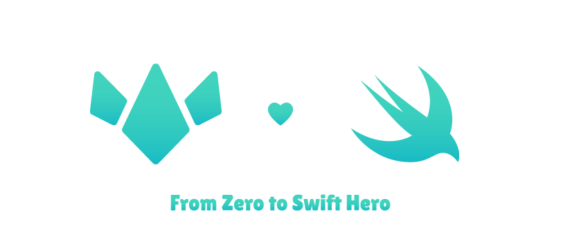

<p align="center"></p>

# Interview Prep
A collection of Swift questions and challenges to help prepare for a Swift / iOS technical interview


<details>
 <summary>The Format:</summary>

 ## Our Question Pages Begin with the Topics to be Covered
 * From Arrays to Strings
 * To running times and more

 ### Our Questions Will Come Next
 Each question is accompanied by a short description of the problem
 #### An Example too, if the problem needs one:
 ```Swift
 someFunc() // written in as a block of code
 ```
 <details>
  <summary><strong>And an inline solution or hint if the problem calls for one:</strong></summary>

  ```Swift
  // a code block here makes the most sense too
  fooFunc(int: coolParams)
  ```
 </details>
</details>

# Questions

| Topics Covered | Questions | Solutions |
|:--------------:|:---------:|:---------:|
|Arrays, etc.    |[The Basics](Questions/questions1.md)|[Solutions](Solutions/questions1.md)|
|Classes, Structs, etc.   |[Object Orientation](Questions/questions2.md)|[Solutions](Solutions/questions2.md)|
